# Enhanced Grid Panel for Grafana

A powerful Grafana panel plugin that provides an advanced grid/table visualization with sophisticated cell highlighting, conditional formatting, server-side operations, and rich data presentation features.

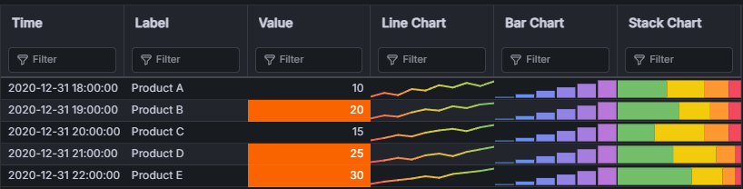

## Features

### Virtualization and Scrolling

Smooth scrolling with sparklines and highlight rules across a 20,000-row dataset.

### 🎨 Advanced Cell Highlighting & Formatting

- **Conditional Formatting Rules**: Apply colors, backgrounds, and styles based on cell values
- **Nested Condition Groups**: Build complex logical expressions like `(A && B) || C` for precise highlighting
- **Multiple Rule Types**:
  - **Threshold Rules**: Color cells based on numeric thresholds
  - **Value Mapping**: Map specific values to colors and icons
  - **Data Range Gradients**: Apply color gradients across value ranges
  - **Flags Columns**: Display icon flags based on conditions
  - **SparkCharts**: Embed mini-charts within cells

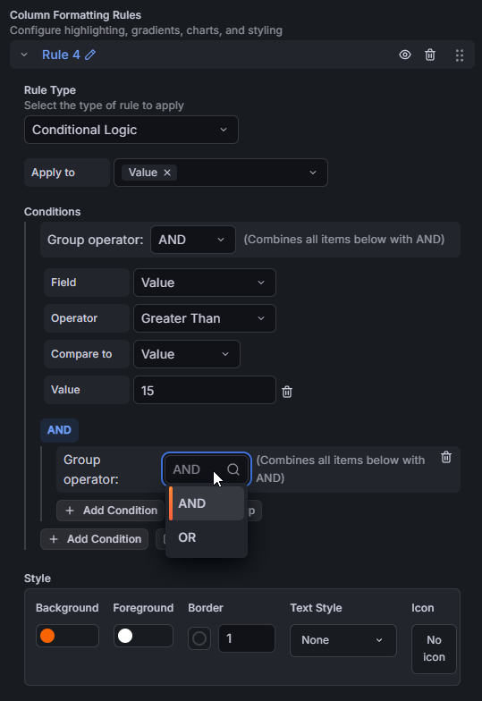
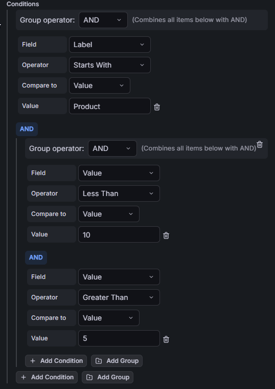

### 🔍 Smart Column Filtering

- **Automatic Type Detection**: Text, numeric, date, and boolean column types
- **Operator-Based Filtering**: Different operators for each column type
  - Text: Contains, Equals, Starts With, Ends With
  - Numbers: =, ≠, >, <, ≥, ≤, Between
  - Dates: Range filtering
- **Client-side & Server-side Support**: Filter locally or push to datasource

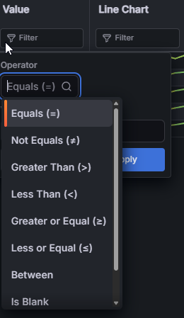

### 📊 Flexible Pagination

- **Client-Side Pagination**: Fast navigation for smaller datasets
- **Server-Side Pagination**: Efficient handling of large datasets with OData/SQL support
- **Configurable Page Size**: Customize rows per page

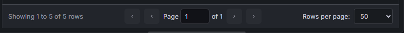

### 🚀 Server-Side Operations

- **OData Support**: Native integration with OData APIs via Infinity datasource
- **SQL Support**: PostgreSQL, MySQL, and other SQL datasources
- **Server-Side Filtering**: Push filters to datasource queries
- **Server-Side Sorting**: Offload sorting to the database
- **Custom Query Formats**: Flexible query parameter customization

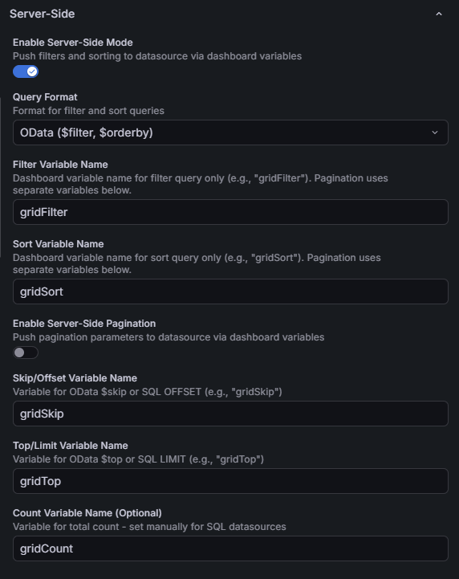

## Installation

1. Download the latest release from the [releases page](https://github.com/kvaron/kvaron-enhancedgrid-panel/releases)
2. Extract to your Grafana plugins directory (usually `/var/lib/grafana/plugins/`)
3. Restart Grafana
4. The panel will appear as "Enhanced Grid" in your visualization options

## Quick Start

### Basic Usage

1. **Add Panel**: Create a new panel in your dashboard
2. **Select Visualization**: Choose "Enhanced Grid" from the visualization picker
3. **Configure Data Source**: Select your data source and query
4. **Customize**: Use the panel options to configure highlighting, filtering, and pagination

### Adding Highlight Rules

1. In panel edit mode, scroll to the **Highlight Rules** section
2. Click **Add Rule**
3. Configure your rule:
   - **Rule Name**: Descriptive name for the rule
   - **Apply To**: Select which columns to apply the rule to
   - **Conditions**: Define when the rule should trigger
   - **Style**: Set colors, background, font weight, etc.

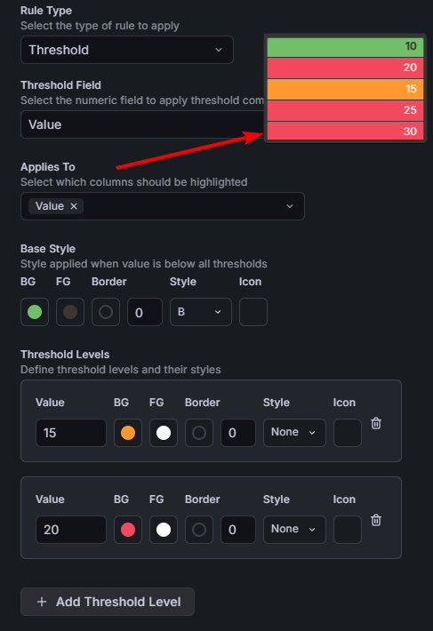
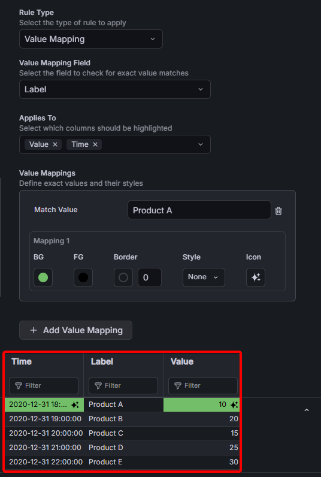

### Enabling Server-Side Operations

For large datasets, enable server-side filtering and pagination:

1. Create dashboard variables: `gridFilter` and `gridSort` (Text box type, hidden)
2. Update your datasource query to use these variables
3. In panel settings, enable **Server-Side Mode**
4. Configure query format (OData, SQL, or JSON)
5. Map variable names

See [Server-Side Setup Guide](docs/SERVER_SIDE_SETUP.md) for detailed instructions.

## Documentation

- **[User Guides](docs/)**: Feature documentation and how-to guides
  - [Server-Side Setup](docs/SERVER_SIDE_SETUP.md)
  - [Quick Start for Server-Side](docs/QUICK_START_SERVER_SIDE.md)

## Examples

### Colored Cells with Thresholds

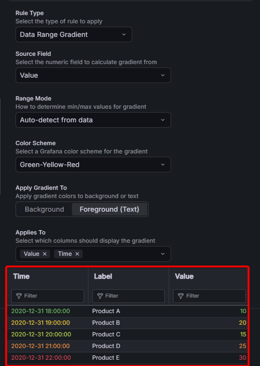

### SparkCharts in Cells

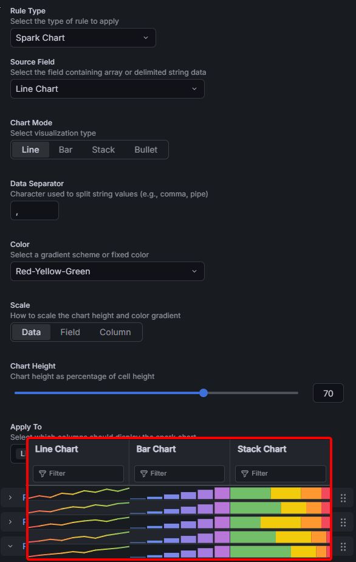

### Flags Column

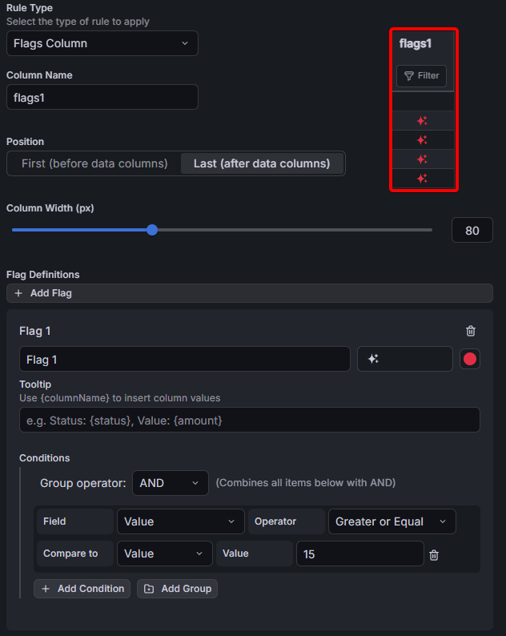

## Support

For issues, feature requests, or questions:

- GitHub Issues: [Report an issue](https://github.com/kvaron/kvaron-enhancedgrid-panel/issues)
- Documentation: Check the [docs](docs/) folder

## Tech Stack

### Runtime Dependencies

| Package                                                                       | Version | Purpose                                                     |
| ----------------------------------------------------------------------------- | ------- | ----------------------------------------------------------- |
| [@tanstack/react-virtual](https://tanstack.com/virtual/latest)                | 3.x     | Virtual scrolling for efficient rendering of large datasets |
| [@emotion/css](https://emotion.sh/)                                           | 11.x    | CSS-in-JS styling                                           |
| [@grafana/ui](https://grafana.com/developers/plugin-tools/)                   | 12.x    | Grafana UI component library                                |
| [@grafana/data](https://grafana.com/developers/plugin-tools/)                 | 12.x    | Grafana data utilities and types                            |
| [@grafana/runtime](https://grafana.com/developers/plugin-tools/)              | 12.x    | Grafana runtime APIs                                        |

### Development Tools

| Tool       | Version | Purpose                |
| ---------- | ------- | ---------------------- |
| TypeScript | 5.9     | Type-safe JavaScript   |
| Webpack    | 5.x     | Module bundler         |
| Jest       | 30.x    | Unit testing framework |
| Playwright | 1.x     | End-to-end testing     |

## License

See [LICENSE](LICENSE) file for details.

## Contributing

Contributions are welcome! Please read the development documentation in [.config/README.md](.config/README.md) before submitting pull requests.
